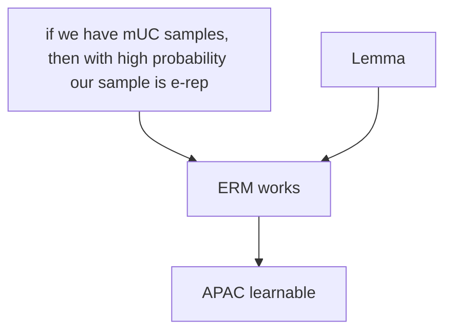

- Outliers, heavy tailed, why is a large sample compared to distribution better?

**In definitions:**
### Agonostic PAC

APAC: Difference between the true risk and the best true risk
But we need more structure

### UC

UC: Difference between the emperical risk and the true risk

If this works, proves ERM is concentrated about your true risk
Goal:
To prove that finite hypothesis classes are A-PAC learnable.

Explained:
3:00 to 10:00

> Proper and non-proper learning, computational complexity (not sample complexity)

Which hypothesis classes are learnable

Approaches:
1. Lower bound: Sample complexity is at least this, for all algorithms, no one can beat this;need to prove that number of samples you need is at least $m_h$
2. Upper bound: Just need to find one algorithm that learn with small sample complexity

Therefore, just choose a certain algorithm and prove it's sample complexity is small, to prove that finite classes are APAC learnable
- Choose ERM

More formally,
Suggestion: Prove an upper bound for sample complexity for a specific algorithm, namely ERM: $A(s) = argmin_{h \in H}L_s(h)$

--> Works on the intuition that if emperical loss is close to the true loss, ERM will work on the distribution because it does on the sample

### $\epsilon$ representative
*S* is $\epsilon$ representative with respect to the *H, X, D, L*, when
$$\forall h \in \mathcal H, \left | L_D(h)-L_s(h) \right | \leq \epsilon$$

> Absolute value --> get lower and upper bounds
Therefore, Lemma:
If S is e-rep, then $$ \left | L_D(A^{ERM}(s))-L_D(h^*) \right | \leq 2\epsilon$$

Proof

Combining both bounds --

$$L_D(A^{ERM}(s))-L_D(h^*) \leq L_S(A^{ERM}(s)) + \epsilon - L_S(h^*) + \epsilon$$
$$= L_D(A^{ERM}(s))-L_D(h^*) \leq L_S(A^{ERM}(s)) - L_S(h^*) + 2\epsilon $$

--> $L_S(A^{ERM}(s)) - L_S(h^*)$ is smaller than $\epsilon$, because ERM works great on the sample
$$ \therefore L_D(A^{ERM}(s))-L_D(h^*) \leq 2\epsilon $$

**or**

Now, we know that a epsilon representative works. To prove now:
Large enough sample is epsilon representative:

**or**

#### Sample complexity of uniform convergence
$m_{h}^{UC}(\epsilon, \delta)$: 
The minimum number such that for every distribution *D*, if we pick a sample of size *m*, then with probablity at least $1 - \delta$, S is epsilon representative  

> How is this extended to APAC learning?

Corollary:
$$m_{H}(\epsilon, \delta) \leq m_{H}^{UC}(\frac{\epsilon}{2}, \delta)$$
--> Sample complexity of APAC, and of uniform convergence

> Why $\epsilon/2$
> 1. You say high probability $1 - \delta$. So is delta always super small, compared to $1 - \delta$
> 2. What if you went with the lower bound approach?
> 3. Does Bayes give you lowest error to compete with or the best hypothesis? Is there any difference? 
> 4. Is Bayes different for diff cases? Yes, no? It's not an absolute lowest.

Now that we know the relationship between the sample complexity of APAC and of uniform convergence
In order to upper bound sample complexity of APAC, we upper bound sample complexity of UC

#### Therefore, new goal
 Find upper bound for $m_{H}^{UC}$ for finite hypothesis case

#### Strategy
Step 1:
For a single hypothesis $h \in \mathcal{H}$, bound in number of samples to make sure $L_D(h) \approx L_S(h)$( with high probability. true error will be close to emperical error if we have enough hypothesis)
For a single hypothesis, we have a bound on sample complexity
> Average of some variable on a small sample is equal to the average over the true distribution
--> We have a bound for this single hypothesis' failure, so let's have a bound for all hypothesis in the class and union bound.

Step 2:
Use UB to bound probability that "any" of them fails

> Concentration inequalities, concentration  of measure - imp

***Markov's -> random variable always concentrates about its expected value***
## [[Heoffding's Inequality]]
--> How does emperical risk concentrate about true risk, with high probability
(for the first step)
> ***Assume that $\theta_1, \theta_2,..,\theta_n$ are iid random variables, from the same dist, with the same mean $\mu$, that take values in $[a,b]$. Then, $$P[|\mu - \frac{1}{m}\sum\theta_i| \geq \epsilon] \leq 2e^{\frac{-2m\epsilon^{2}}{(b-a)^{2}}}$$*

- same mean because iid, and bounded
- Since it has a probabilistic nature, you could have outliers that count, and so it is difficult to say that the true average and empirical average are epsilon close
- Therefore, we say instead that the probability that they are more than epsilon close (or that they are far) is small. We bound the probability
- Therefore, they are not close, but probability that they are far is small
- Note exponential, therefore very powerful
> Why random variables, what is the significance of random variables here?

#### How is this useful?
Go from loss to average? How? Using expectations

> Why can you replace means with average losses? losses are finite too, they take values in $[0,1]$ just like the random variables above. b and a replaced by 1 and 0.

Therefore, step 1 done
Now generalise to all hypotheses in the class, using union bound
We want to upper bound the probability that S is not epsilon representative

Show that the probability that one h fails is utmost the sum of the probability that each of them fails

Therefore,
$$P[\exists h \in \mathcal{H}, s.t |L_D(h) - L_S(h)|>\epsilon]$$
$$\leq \sum_{h \in H} P[|L_D(h) - L_S(h)|>\epsilon]$$
$$LHS \leq \sum_{h \in H} 2e^{\frac{-2m\epsilon^{2}}{1}}$$
$$ = |H|.2e^{-2m\epsilon^{2}}$$

Therefore, probability of error is less. What does this imply about $m_{H}^{UC}$?
How does one use this to bound sample complexity?

This bounds sample complexity of UC.
Now bound sample complexity of APAC

### Concentration Inequalities: A Nonasymptotic Theory of Independence - Gabor 