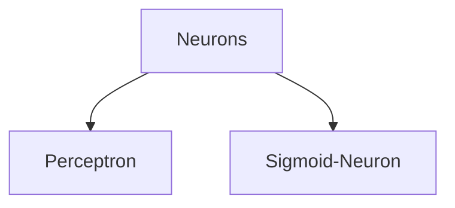

# Ideas
```
1. Start with basic logic, then to perceptron (and bring in the biological neuron here), and then move to sigmoid neurons
2. Can you use sigmoid neurons and perceptrons together? Does the activation function have to be the same theoughout?
3. Sigmoid neurons simulating perceptrons. Write more.
4. Figure out how to do handwriting classificartion using perceptrons. Then translate to nand gates. Could we somehow make it physical then?
```


> If not for artificial intelligence, how might you have gone about getting a computer to recognise handwritten digits? (If you start with that as your problem statement and don't have to commit to the NN (or even ML) paradigm, how would you proceed? Would you end up with AI/ML?)
> Start with the program to recognise that a 7 is a horizontal line up top, and a slant vertical one. You'd have to make *rules*. How far can this approach take you?

So neural networks it is

# Perceptron


- Values to set: Weights and threshold
- A more complex network of perceptrons could be used to make a more nuanced decision


Using vectors, threshhold is essentially bias term
- *You can think of the bias as a measure of how easy it is to get the perceptron to output a 1. Or to put it in more biological terms, the bias is a measure of how easy it is to get the perceptron to fire. *

Similarly, since perceptrons are single output (0 or 1), you could use them as logic gates. Look at inputs, then output. Depending on values chosen for w and b, you'll realise perceptron acts as a particular gate. A neural network is a bunch of gates, essentially. But more importantly, you could realise boolean logic using perceptrons and neural networks!
--> Think more about this during DSD class

*The computational universality of perceptrons is simultaneously reassuring and disappointing. It's reassuring because it tells us that networks of perceptrons can be as powerful as any other computing device. But it's also disappointing, because it makes it seem as though perceptrons are merely a new type of NAND gate. That's hardly big news!*

[Half adder using NAND gates](hadder-lg.png)

[Half adder using Perceptrons](hadder-p.png)

*** And because NAND gates are universal for computation, it follows that perceptrons are also universal for computation.***

## What is learning?

- Essentially, a small change in weights or biases produces a small change to the output. When this happens, the machine *learns*

> Why would this be hard to do using perceptrons? What allows sigmoid neurons to learn, but doesn't let perceptrons learn?
>  *In fact, a small change in the weights or bias of any single perceptron in the network can sometimes cause the output of that perceptron to completely flip, say from 0 to 1. That flip may then cause the behaviour of the rest of the network to completely change in some very complicated way. So while your "9" might now be classified correctly, the behaviour of the network on all the other images is likely to have completely changed in some hard-to-control way. That makes it difficult to see how to gradually modify the weights and biases so that the network gets closer to the desired behaviour. Perhaps there's some clever way of getting around this problem. But it's not immediately obvious how we can get a network of perceptrons to learn.*

# Sigmoid Neurons
- Similar inputs, outputs however, range between 0 and 1
- Instead of output = $w.x + b$, output is now given by $\sigma(w.x + b)$.
- Sigma/logistic function $$\sigma(z) = \frac{1}{1 + e^{-z}}$$, where $z = w.x + b$

> Difference between the step function, sigma function, and what the perceptron does is what?


- That smoothness is what really matters. Can be achieved uisng other activation functions as well, not just the sigmoid.

> What makes the sigmoid work? (*exponentials have lovely properties when differentiated.*)

Talk about this --> bring more connections. (For `Ideas`)


# Architecture
### Hidden layers
*While the design of the input and output layers of a neural network is often straightforward, there can be quite an art to the design of the hidden layers. In particular, it's not possible to sum up the design process for the hidden layers with a few simple rules of thumb. Instead, neural networks researchers have developed many design heuristics for the hidden layers, which help people get the behaviour they want out of their nets. For example, such heuristics can be used to help determine how to trade off the number of hidden layers against the time required to train the network.*

> *You might wonder why we use 10 output neurons. After all, the goal of the network is to tell us which digit (0,1,2,…,9) corresponds to the input image. A seemingly natural way of doing that is to use just 4 output neurons, treating each neuron as taking on a binary value, depending on whether the neuron's output is closer to 0 or to 1. Four neurons are enough to encode the answer, since 24=16 is more than the 10 possible values for the input digit. Why should our network use 10 neurons instead? Isn't that inefficient? The ultimate justification is empirical: we can try out both network designs, and it turns out that, for this particular problem, the network with 10 output neurons learns to recognize digits better than the network with 4 output neurons. But that leaves us wondering why using 10 output neurons works better. Is there some heuristic that would tell us in advance that we should use the 10-output encoding instead of the 4-output encoding?*


### Gradient Descent

*So the aim of our training algorithm will be to minimize the cost C(w,b) as a function of the weights and biases. In other words, we want to find a set of weights and biases which make the cost as small as possible. We'll do that using an algorithm known as gradient descent.*

> Why introduce the quadratic cost? After all, aren't we primarily interested in the number of images correctly classified by the network? Why not try to maximize that number directly, rather than minimizing a proxy measure like the quadratic cost? The problem with that is that the number of images correctly classified is not a smooth function of the weights and biases in the network. For the most part, making small changes to the weights and biases won't cause any change at all in the number of training images classified correctly. That makes it difficult to figure out how to change the weights and biases to get improved performance. If we instead use a smooth cost function like the quadratic cost it turns out to be easy to figure out how to make small changes in the weights and biases so as to get an improvement in the cost. That's why we focus first on minimizing the quadratic cost, and only after that will we examine the classification accuracy.


# Representation


